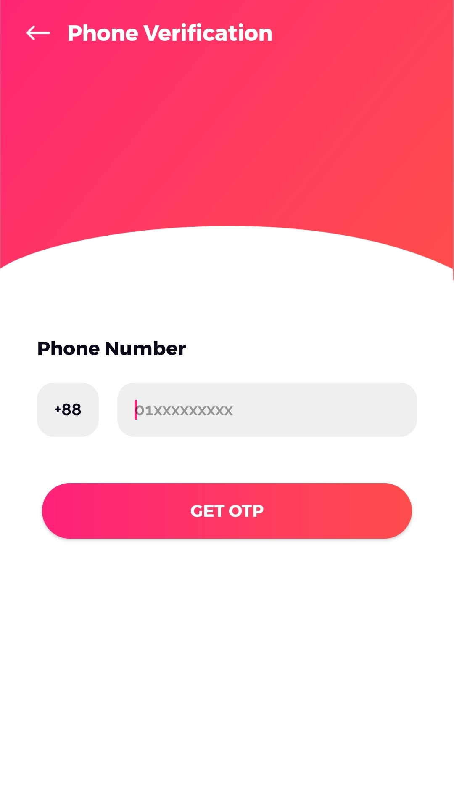
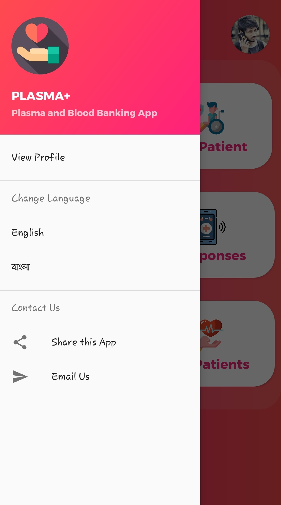

# PlasmaPlus

A free Android application designed to connect blood and plasma donors with those in need. The app provides a convenient and reliable platform for donors and recipients to communicate, schedule donations, and save lives.

## Features
- Connects blood and plasma donors with recipients in need.
- Data privacy
- Quick user registration & profile creation
- Location-based filtering for finding donors.
- Real-time notifications for new donation requests and responses.
- Eligibility check for donors

## Installation
To run this project locally, follow these steps:

1. **Clone the repository**:
   ```bash
   git clone https://github.com/tanvir1111/PlasmaPlus.git
   cd PlasmaPlus
   ```
2. **Open the Project**: Open the project in Android Studio or your favorite IDE.
3. **Add Dependencies**: Update the dependencies in the app/build.gradle file:
   ```Java
   dependencies {
    
    implementation 'com.google.firebase:firebase-analytics:17.2.2'
    implementation 'com.google.firebase:firebase-auth:19.3.2'
    implementation 'com.google.firebase:firebase-messaging:20.2.1'
    implementation 'com.squareup.retrofit2:retrofit:2.1.0'
    implementation 'com.squareup.retrofit2:converter-gson:2.1.0'
    implementation 'com.squareup.picasso:picasso:2.71828'
    implementation 'org.jsoup:jsoup:1.11.1'
    api 'com.theartofdev.edmodo:android-image-cropper:2.8.+'
    }

   ```
4. **Build and Run**: Once dependencies are added, build and run the app on an Android emulator or a physical device.

## Screens of the app

<br />
<p align="center">
  
  <br>
  <br>
  <br>
  <br>
  
  
  
  
  <br>
  <br>
  
  
  
  

  <br>
  <br>
  
  
  
  
 
  <br>
  <br>
  <br>
 

</p>
